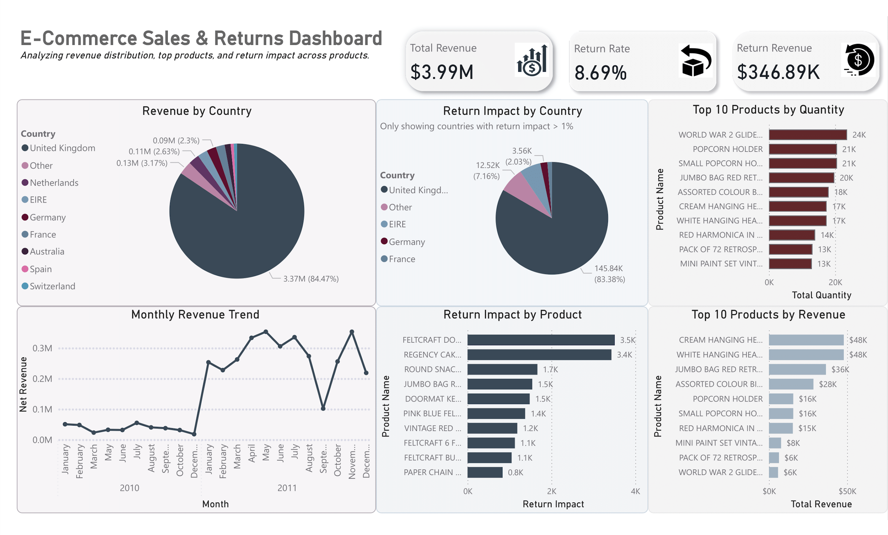

# 📊 E-Commerce Sales & Returns BI Project  
End-to-end data analytics pipeline built using **Python, SQL (MySQL), and Power BI**.  
This project analyzes e-commerce sales, return behavior, product performance, and customer activity across two years of transaction data.

---

## 🚀 1. Project Overview
This project demonstrates a full analytics workflow:

1. **Data Cleaning & Transformation** (Python + SQL)
2. **Staging Area Setup** (stg_sales)
3. **Dimensional Data Modeling** (Star Schema)
4. **EDA – Exploratory Data Analysis** (Python: Pandas, Seaborn, Plotly)
5. **Interactive Power BI Dashboard**
6. **Business Insights & Findings**

It reflects how data flows in a real analytics environment—from raw CSV → clean dataset → data warehouse → BI dashboard.

---

## 🛠 Tech Stack
- **Python (EDA + preprocessing)**
- **MySQL (Staging & Data Warehouse)**
- **Excel (Data Cleaning)**
- **SQL (Star Schema, Fact/Dimension load scripts)**
- **Power BI (Reporting & DAX)**
- **Pandas, Numpy, Seaborn, Plotly**  
- **SQLAlchemy, mysql-connector-python**

---

## 🧹 2. Data Cleaning (Excel)

Before loading the dataset into SQL, an initial cleaning phase was performed in **Microsoft Excel** to ensure data quality and prepare the file for the staging table.

## 🧱 2. Data Model (Star Schema)

        dim_customer
              ▲
              │
        fact_sales  ◄── dim_product
              ▲
              │
          dim_date

- **fact_sales:** transactional data (grain = one row per invoice line)
- **dim_product:** product details + smart product naming
- **dim_customer:** customer & country
- **dim_date:** calendar table (Year, Month, Day, MonthName, Quarter)

This structure supports fast analytical queries and flexible reporting.

---

---

## 🔍 4. Exploratory Data Analysis (Python)

The EDA focuses on:
- Unit price distribution  
- Daily/Monthly revenue  
- Customer purchasing patterns  
- Top countries by revenue  
- Top products by revenue & quantity  

### 📈 Example EDA Outputs

#### **Top 10 Countries by Revenue**

#### **Daily Revenue Trend**

#### **Top 10 Products by Quantity**

---

## 📊 5. Power BI Dashboard

An interactive dashboard that provides:
- Revenue KPIs  
- Return rate & return revenue  
- Revenue by country  
- Monthly revenue trend  
- Top products by quantity & revenue  
- Return impact analysis  

### 📸 Dashboard Preview  

---

## 🧩 6. SQL Workflow Summary

All SQL scripts are available in `sql/main.sql`.

Key steps:
- Create staging table (`stg_sales`)
- Clean raw data (dates, decimals, trimming, IsReturn)
- Build dimension tables with surrogate keys
- Load fact_sales with foreign keys
- Enforce referential integrity

---

## 🧪 7. Installation & Setup

## 8. Business Insights
🇬🇧 United Kingdom generates 84% of all revenue.
📦 A small group of products contributes disproportionately to sales.
🔁 Return rate is 8.69%, with certain products driving the majority of returns.
📈 Monthly revenue shows strong seasonal peaks toward the holiday period.
🌍 Several countries contribute minimal revenue → potential expansion opportunities.
